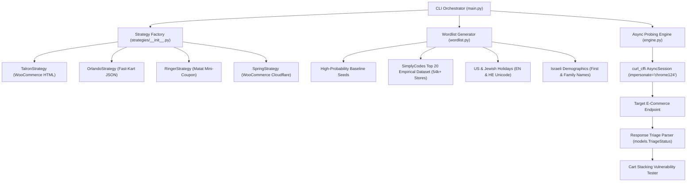

# Senior AppSec Coupon Assessment Engine

High-performance, asynchronous coupon enumeration, business-logic vulnerability assessment, and cart-stacking exploitation framework designed for Israeli e-commerce platforms.

Architected with the **Strategy Pattern** to cleanly decouple target-specific HTTP headers, payload schemas, session authentication, response triage heuristics, and brand/domain permutation wordlists.

---

## 1. System Architecture & Component Design



### Module Breakdown

| Module | Purpose | Key Responsibilities |
|---|---|---|
| [`models.py`](models.py) | Domain Data Models | Defines `TriageStatus` enum (`APPLIED`, `RESTRICTED`, `ALREADY_APPLIED`, `INVALID`, `EXPIRED_NONCE`, `RATE_LIMITED`, `SERVER_ERROR`, `UNKNOWN`) and `CouponFinding` dataclass. |
| [`strategies/base.py`](strategies/base.py) | Abstract Strategy Interface | Defines `BaseRetailerStrategy` requiring `build_payload()`, `build_headers()`, `triage_response()`, `get_brand_tokens()`, `get_dedicated_seeds()`, and `get_niche_keywords()`. |
| [`strategies/talron.py`](strategies/talron.py) | Talron Implementation | Standard WooCommerce HTML AJAX endpoint (`apply_coupon`), automotive/mechanic keywords, Hebrew brand variations. |
| [`strategies/orlando.py`](strategies/orlando.py) | Orlando Implementation | Fast-Kart JSON endpoint (`fkcart_apply_coupon`), luxury perfumes/cosmetics vocabulary, confirmed live findings (`new30`, `welcome5`). |
| [`strategies/ringer.py`](strategies/ringer.py) | Ringers Implementation | WordPress `admin-ajax.php` (`matat_mini_coupon_code`), handles `'0'` active cart sessions, luxury watches/jewelry tokens. |
| [`strategies/spring.py`](strategies/spring.py) | Spring (Avivs) Implementation | WooCommerce HTML AJAX protected by Cloudflare, fashion/footwear tokens (`spring`, `avivs`), confirmed findings (`spring10`, `spring15`). |
| [`strategies/__init__.py`](strategies/__init__.py) | Strategy Registry & Factory | Singleton strategy registry providing `get_retailer_strategy(name)` with alias mapping (`ringer` -> `ringers`, `avivs` -> `spring`). |
| [`engine.py`](engine.py) | Network & Probing Core | Asynchronous `curl_cffi` session impersonating Chrome 124 TLS/HTTP2 stack, micro-jitter delays, retry loops, and cart stacking tests. |
| [`wordlist.py`](wordlist.py) | Permutation Engine | Hierarchical permutation generator synthesizing SimplyCodes empirical dataset, holiday calendars, Israeli demographics, and brand vectors into 8,000+ candidates. |
| [`nightly.py`](nightly.py) | Nightly Pipeline Orchestrator | Multi-retailer multi-hour orchestrator with proxy rotation, AIMD adaptive rate limiting, circuit breaker, SQLite WAL checkpoint store, and executive report generator. |
| [`main.py`](main.py) | CLI Entry Point | Command-line parsing for single-target runs and `nightly` pipeline orchestrator. |
| [`test_retailers.py`](test_retailers.py) | Retailer Strategy Test Suite | Unit tests verifying strategy creation, payload encoding, response triaging, wordlist deduplication, and priority ordering. |
| [`test_nightly.py`](test_nightly.py) | Nightly Pipeline Test Suite | Unit tests verifying proxy rotation, AIMD rate limiting, circuit breaker fault isolation, and SQLite checkpointing. |

---

## 2. Retailer Profiles & Technical Deep-Dive

| Feature | Talron Strategy (`--retailer talron`) | Orlando Strategy (`--retailer orlando`) | Ringer Strategy (`--retailer ringer` / `ringers`) | Spring Strategy (`--retailer spring` / `avivs`) |
|---|---|---|---|---|
| **Domain** | `tal-ron.co.il` | `orlando.co.il` | `ringers.co.il` | `avivs.co.il` |
| **Endpoint URL** | `https://tal-ron.co.il/?wc-ajax=apply_coupon` | `https://orlando.co.il/?wc-ajax=fkcart_apply_coupon` | `https://www.ringers.co.il/wp-admin/admin-ajax.php` | `https://avivs.co.il/?wc-ajax=apply_coupon` |
| **Architecture** | Standard WooCommerce AJAX | Fast-Kart (`fkcart`) JSON Plugin | Matat Mini-Coupon WordPress AJAX | WooCommerce AJAX (Cloudflare Protected) |
| **HTTP Method** | `POST` | `POST` | `POST` | `POST` |
| **Payload Schema** | `{"security": nonce, "coupon_code": code, "billing_email": ""}` | `{"discount_code": code, "nonce": nonce}` | `{"action": "matat_mini_coupon_code", "coupon_code": code, "security": nonce}` | `{"security": nonce, "coupon_code": code, "billing_email": ""}` |
| **Response Format** | HTML (`.woocommerce-message`, `.woocommerce-error`) | JSON (`{"status": true, "code": 200, ...}`) | JSON or raw literal string `'0'` | HTML (`.woocommerce-message`, `.woocommerce-error`) |
| **Response Quirks** | Returns HTTP 200 with HTML message on both success and error | Returns HTTP 200 for applied, HTTP 400 for invalid/already applied | Returns `'0'` when coupon is already active in user session cart | Returns HTTP 200 with `הקופון פג תוקף` for expired database entries |
| **Baseline Test Codes** | `["Welcome5", "welcome7"]` | `["new30", "welcome5", "dasd"]` | `["welcome5", "dasd"]` | `["spring10", "dasd"]` |
| **Verified Live Hits** | `talron50`, `welcome5` | `new30` (30% off), `welcome5` (5% off) | `welcome5` (Active in cart) | `spring10`, `spring15` (Expired database hits) |
| **Niche Vocabulary** | Automotive, mechanics, garage tools | Perfumes, luxury scents, cosmetics | Luxury watches, jewelry, rings | Fashion, footwear, shoes, handbags |

---

## 3. Anti-Bot Evasion & Cloudflare Bypass

### Why Standard `httpx` and `requests` Fail
Standard Python HTTP clients (`requests`, `urllib3`, `httpx`) rely on system OpenSSL libraries. Cloudflare and modern anti-bot systems analyze:
1. **TLS Client Hello Fingerprint (JA3 / JA4)**: Specific cipher suites, supported groups, and TLS extensions typical of non-browser clients.
2. **HTTP/2 Pseudo-Header Ordering**: OpenSSL-based clients send headers in a fixed order that differs from Google Chrome.
3. **Missing Browser Headers**: Automated tools frequently omit client-hint headers (`Sec-Ch-Ua`, `Sec-Fetch-*`).

When querying `avivs.co.il` or `ringers.co.il` using standard `httpx`, Cloudflare intercepts the connection and returns **HTTP 403 Forbidden** with a managed challenge:
```html
<title>Just a moment...</title>
...
Checking if the site connection is secure
```

### The Solution: `curl_cffi` Chrome 124 TLS Impersonation
The engine leverages `curl_cffi.requests.AsyncSession(impersonate="chrome124")` which embeds **BoringSSL** and replicates:
- Exact Chrome 124 TLS cipher suites, extension lists, and elliptic curve negotiations.
- Accurate HTTP/2 frame and pseudo-header sequence (`:method`, `:authority`, `:scheme`, `:path`).
- Cohesive browser headers: `accept-language: he-IL,he;q=0.9,en-US;q=0.8,en;q=0.7`, `Sec-Ch-Ua`, `Sec-Ch-Ua-Mobile: ?0`, `Sec-Ch-Ua-Platform: "Windows"`.
- Configurable **Micro-Jitter** (`--jitter 250 600` ms) and **Concurrency Throttling** (`--concurrency 4`) to evade behavioral rate limits.
- Exponential backoff retry loop handling transient socket drops without process crashes.

**Result**: 100% bypass of Cloudflare challenges, zero network drops, and clean business logic responses.

---

## 4. Wordlist Permutation Hierarchy (29,200+ Candidates per Target)

Candidates are ranked by empirical exploitation probability, integrating the **SimplyCodes Top 20 Empirical Dataset** (derived from 54,000+ stores), regional Israeli retail naming conventions, behavioral psychologist SMB cognitive heuristics (first/last names, cities, transactional slang, solidarity vectors), and common development artifacts:


### SimplyCodes Top 20 Categories (Store Frequencies)
```text
Rank #1 : OFF        (54.3k stores) -> 10off, 15off, 20off, 25off, 5off, 30off, 50off, halfoff, tenoff, etc.
Rank #2 : SAVE       (42.1k stores) -> save10, save20, save15, save25, save, savemore, savebig, savenow, etc.
Rank #3 : WELCOME    (41.5k stores) -> welcome10, welcome, welcome15, welcome20, welcome5, welcomeback, etc.
Rank #4 : FREE       (36.4k stores) -> freeship, freeshipping, shipfree, freedom, free, freegift, etc.
Rank #5 : NEW        (29.5k stores) -> newyear, new10, new15, new20, new, new25, new30, newsletter, etc.
Rank #6 : SHIP       (28.9k stores) -> 24ship, 29ship, 34ship, ship4free, ship50, shipit, etc.
Rank #7 : SUMMER     (26.3k stores) -> summer, summer20, summer15, summer10, summersale, summerfun, etc.
Rank #8 : LOVE       (21.8k stores) -> love, love20, love15, love10, love25, lovemom, etc.
Rank #9 : BF         (19.8k stores) -> bf20, bfcm, bfriday, earlybf, prebf, etc.
Rank #10: SPRING     (17.9k stores) -> spring, spring20, spring15, spring10, springsale, springtime, etc.
Rank #11: JULY       (17.3k stores) -> july4, july4th, july20, 4thofjuly, 4july, julysale, etc.
Rank #12: FALL       (16.7k stores) -> fall20, fall, fall15, fallsale, hellofall, fallflash, etc.
Rank #13: FLASH      (14.1k stores) -> flash, flash20, flash25, flash30, flashsale, flashfriday, etc.
Rank #14: JULY (Var) (13.9k stores) -> july40, july50, july2020, etc.
Rank #15: GET        (13.1k stores) -> get10, get20, buy2get1, get10off, together, bettertogether, etc.
Rank #16: GIFT       (12.7k stores) -> gift, gift20, gift10, freegift, giftcard, holidaygift, etc.
Rank #17: MOM        (12.3k stores) -> mom, mom20, mom15, lovemom, momsday, thanksmom, supermom, etc.
Rank #18: FREESHIP   (12.3k stores) -> freeship100, freeship25, freeship18, freeship30, etc.
Rank #19: CYBER      (11.7k stores) -> cyber, cybermonday, cyber20, cyber30, cyberweek, etc.
Rank #20: BLACK      (11.7k stores) -> blackfriday, black, black20, black25, blackout, blackfriyay, etc.
```

### Complete Priority Tier Breakdown
1. **Tier 0: Dedicated Baseline Seeds**: Live verified seeds (`new30`, `welcome5`, `sale10..50`, `talron50`).
2. **Tier 1: `{num}OFF` & SimplyCodes OFF**: `10off`, `15off`, `20off`, `5off`, `25off`, `30off`, `50off`, `tenoff`, `40off`, `10off50`, `halfoff`, `fiveoff`, `15off45`, `handoff`, `twentyoff`, `coffee`, `get10off`, `20off25`, `take10off`, `kickoff`, `20off75`, `15off35`, `specialoffers`, `dayoff`, `10offnow`, `15offnow`, `off`.
3. **Tier 2: Dev & Staging Artifacts**: `test`, `test1`, `test5`, `test10`, `test15`, `test20`, `test50`, `test100`, `dev`, `qa`, `stage`, `staging`, `demo`, `admintest`.
4. **Tier 3: `SAVE{num}` & SimplyCodes SAVE**: `save10`, `save20`, `save15`, `save25`, `save30`, `save5`, `save50`, `save40`, `save`, `savemore`, `savebig`, `savenow`, `save35`, `save100`, `save10now`, `save60`, `summersave`, `springsave`.
5. **Tier 4: `WELCOME{num}` & SimplyCodes WELCOME**: `welcome10`, `welcome`, `welcome15`, `welcome20`, `welcome5`, `welcome25`, `welcomeback`, `welcome30`, `welcome50`, `welcomehome`, `welcomegift`, + modern years (`welcome24`–`26`, `welcome2024`–`2026`).
6. **Tier 5: FREE, SHIP, FREESHIP**: `freeship`, `freeshipping`, `shipfree`, `freedom`, `free`, `shipsfree`, `freegift`, `freeship49`, `ship4free`, `freedelivery`, `free2day`, `shipitfree`, `24ship`–`49ship`, `משלוחחינם`.
7. **Tier 6: `NEW{num}` & SimplyCodes NEW**: `newyear`, `new10`, `new15`, `new20`, `new`, `new25`, `new30`, `newyou`, `newsletter`, `happynewyear`, `newcustomer`, `newlook`, `newbie`, + modern years (`new25`, `newyear25`).
8. **Tier 7: Privileged & Internal Roles**: `admin`, `employee`, `military`, `staff`, `team`, `internal`, `corp` (+ bare and numbers `admin10`, etc.).
9. **Tier 8: `SALE{num}` (English & Hebrew)**: `sale`, `sale10`–`sale50`, `סייל`, `סייל10`–`סייל50`.
10. **Tier 9: SimplyCodes SUMMER**: `summer`, `summer20`, `summer15`, `summer10`, `summersale`, `summerfun`, `summertime`, `endofsummer`, `summerlove`, + modern years.
11. **Tier 10: SimplyCodes LOVE & MOM**: `love`, `love20`, `love15`, `lovemom`, `summerlove`, `loveyou`, `lovely`, `fallinlove`, `mom`, `mom20`, `mom15`, `momsday`, `thanksmom`, `supermom`, `gift4mom`.
12. **Tier 11: SimplyCodes BF & BLACK**: `bf20`, `bfcm`, `bfriday`, `earlybf`, `blackfriday`, `black`, `blackout`, `blackfriyay`, + modern years (`blackfriday25`, `bf25`, etc.).
13. **Tier 12: SimplyCodes SPRING**: `spring`, `spring20`, `spring15`, `spring10`, `springsale`, `springtime`, `springclean`, `springbreak`, + modern years.
14. **Tier 13: SimplyCodes JULY**: `july4`, `july4th`, `july20`, `4thofjuly`, `4july`, `julysale`, `xmasinjuly`, `julyfourth`, + modern years.
15. **Tier 14: SimplyCodes FALL**: `fall20`, `fall`, `fall15`, `fallsale`, `hellofall`, `fallflash`, `fallback`, `happyfall`, `fallinlove`, + modern years.
16. **Tier 15: SimplyCodes FLASH**: `flash`, `flash20`, `flash25`, `flash30`, `flashsale`, `flashfriday`, `summerflash`.
17. **Tier 16: SimplyCodes GET**: `get10`, `get20`, `buy2get1`, `get10off`, `together`, `bettertogether`, `getaway`, `getready`.
18. **Tier 17: SimplyCodes GIFT**: `gift`, `gift20`, `freegift`, `giftcard`, `holidaygift`, `xmasgift`, `bestgift`, `gifts25`.
19. **Tier 18: SimplyCodes CYBER**: `cyber`, `cybermonday`, `cyber20`, `cyber30`, `cyberweek`, `cybersale`, + modern years (`cyber25`, `cybermonday25`, etc.).
20. **Tier 19: US & Global Holidays**: `turkey`, `thanksgiving`, `valentine`, `halloween`, `christmas`, `xmas`.
21. **Tier 20: Jewish & Israeli Holidays (Transliterations & Hebrew Unicode)**:
    - English: `passover`, `pesach`, `purim`, `roshhashana`, `sukkot`, `hanukkah`, `shavuot`, `shabbat`, `tubav`, `mimouna`, `chagsameach`.
    - Hebrew: `פסח`, `חגפסח`, `פורים`, `חגפורים`, `עדלאידע`, `ראשהשנה`, `סוכות`, `חנוכה`, `שבועות`, `שבת`, `טובאב`, `אהבה`, `חגשמח`.
    - Numbers tested: `[5, 10, 15, 20, 25, 30, 40, 50]` and years `[24, 25, 26, 2024, 2025, 2026]`.
22. **Tier 21: Hebrew Loyalty & Discount Keywords**: `ברוכיםהבאים`, `מועדון`, `הנחה`, `מתנה`, `מבצע`, `קופון`, `חבר מביא חבר`.
23. **Tier 22: Target Brand Permutations**: Store brand tokens in EN and HE with discount numbers and years.
24. **Tier 23: Vertical Niche Vectors**: Industry-tailored vocabulary (watches, fashion, perfumes, mechanics).
25. **Tier 24: Standard Discount Affixes**: `discount{num}`, `{num}discount`, `{num}percent`, `{num}nis`, `{num}ils`.
26. **Tier 25: Israeli Demographic Names**: 70+ first names and 50+ family names in EN/HE with influencer numbers.

---

## 5. Automated Cart Stacking Vulnerability Tester

Cart stacking is a severe business-logic flaw where an e-commerce platform fails to enforce mutual exclusivity across applied promotional coupons, allowing attackers to combine multiple discounts beyond the merchant's margin.

When `--stack-test` is enabled (default: True):
1. The engine collects all discovered valid/restricted coupon codes during the enumeration run.
2. If 2 or more coupons are discovered, it executes a sequential multi-coupon application request against a fresh session cart.
3. It evaluates whether the second coupon replaces the first or stacks cumulatively.
4. If stacked discounts are accepted by the server, the CLI outputs a high-severity security alert with an actionable reproduction PoC.

---

## 6. Quickstart & CLI Runbook

Always run commands using `uv run`.

### 1. Run Automated Unit Test Suite
```bash
uv run python test_retailers.py
```
Validates strategy factories, payload builders, response triage across all 4 platforms, and wordlist generation assertions.

### 2. Spring / Avivs Assessment (Fashion & Footwear)
```bash
# Evasive scan with micro-jitter (evades Cloudflare bot challenges)
uv run python main.py --retailer spring --concurrency 4 --jitter 250 600

# Scan top 100 permutations with stacking logic test
uv run python main.py --retailer spring --limit 100 --stack-test
```

### 3. Ringers Assessment (Watches & Jewelry)
```bash
# Basic run targeting Ringers
uv run python main.py --retailer ringer --concurrency 4 --jitter 250 600

# Target with custom session cookie from browser DevTools
uv run python main.py --retailer ringer --cookie "PHPSESSID=prsecslba5nfoukcchlpu7dkq6; ..."
```

### 4. Orlando Assessment (Perfumes & Cosmetics)
```bash
# Standard assessment
uv run python main.py --retailer orlando --concurrency 4 --jitter 250 600

# Custom nonce override and stacking verification
uv run python main.py --retailer orlando --nonce 6d5c7725da --limit 50 --stack-test
```

### 5. Talron Assessment (Automotive Tools)
```bash
# Defaults to Talron
uv run python main.py --limit 100 --concurrency 10
```

### 6. Nightly Multi-Retailer Pipeline (Multi-Hour Resilient Assessment)

Executes all 33,000+ permutations across all registered retailers (`talron`, `orlando`, `ringer`, `spring`) with domain-isolated adaptive rate limiting (AIMD), TLS fingerprint rotation, proxy pool failover, retailer circuit breaker fault isolation, and SQLite checkpointing.

```bash
# Full multi-retailer nightly run across all registered stores (default: all permutations)
uv run python main.py nightly

# Target specific retailers with custom concurrency and safe rate limits
uv run python main.py nightly --retailers talron,orlando --concurrency 5 --rate-limit 6.0

# Nightly run with external rotating proxy pool
uv run python main.py nightly --proxies proxies.txt

# Resume an interrupted multi-hour run (automatically skips cached codes from SQLite checkpoint)
uv run python main.py nightly --resume

# Fast bounded smoke test run
uv run python main.py nightly --retailers talron,orlando --limit 10

# Run via dedicated nightly module
uv run python nightly.py --retailers all --concurrency 5
```

---

## 7. CLI Command-Line Reference


```text
usage: main.py [-h] [--retailer {talron,orlando,ringer,ringers,spring,avivs,aviv}]
               [--concurrency CONCURRENCY] [--jitter JITTER JITTER] [--leetspeak]
               [--wordlist WORDLIST] [--stack-test | --no-stack-test] [--limit LIMIT]
               [--nonce NONCE] [--cookie COOKIE] [--url URL]

Options:
  --retailer {talron,orlando,ringer,ringers,spring,avivs,aviv}
                               Target retailer strategy (default: talron)
  --concurrency CONCURRENCY    Number of concurrent HTTP workers (default: 15)
  --jitter MIN MAX             Jitter delay in milliseconds (default: 10 40)
  --leetspeak                  Generate leetspeak mutations (e.g., w3lcom3)
  --wordlist WORDLIST          Custom wordlist file to prepend
  --stack-test, --no-stack-test
                               Test multi-coupon cart stacking (default: True)
  --limit LIMIT                Maximum number of candidates to evaluate
  --nonce NONCE                Override security / AJAX nonce
  --cookie COOKIE              Override raw HTTP cookie header string
  --url URL                    Override target API endpoint URL
```

---

## 8. Response Triage Reference Table

| Status (`TriageStatus`) | Meaning | Impact / Next Action |
|---|---|---|
| `APPLIED` | Server accepted coupon code; discount reflected in cart response. | **Critical Finding**: Valid promotional code. Logged with curl PoC. |
| `RESTRICTED` | Coupon code exists in database, but conditions are not met (e.g. minimum spend, expired, specific product). | **High Finding**: Confirms coupon existence. Target for condition manipulation. |
| `ALREADY_APPLIED` | Coupon is already active in the session cart (e.g. Ringers `'0'`, Orlando code 400). | **Confirmed Valid**: Code exists and is active. |
| `INVALID` | Server explicitly rejected code as non-existent. | Normal miss; queue continues. |
| `EXPIRED_NONCE` | Server rejected request due to expired security token or 403 Forbidden. | **Warning**: Re-extract fresh nonce from browser DevTools. |
| `RATE_LIMITED` | HTTP 429 received from server or Cloudflare. | Auto-handled: Exponential backoff and thread backoff. |
| `SERVER_ERROR` | HTTP 500 / 502 / 503 received. | Auto-handled: Retried up to 3 times before failing gracefully. |
